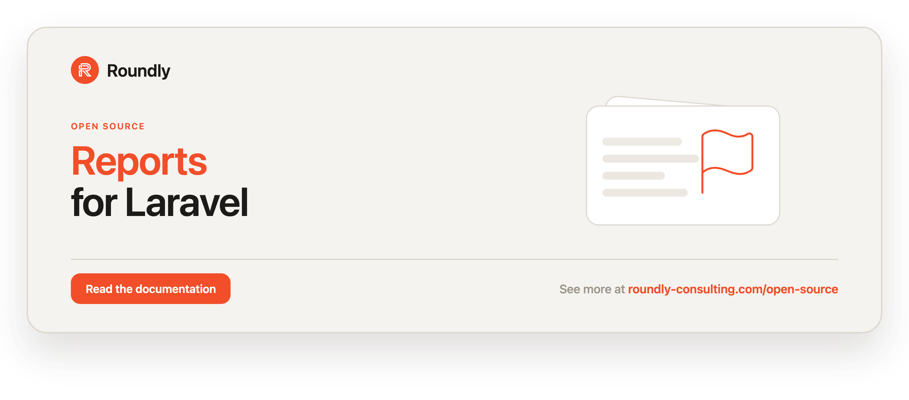

<!-- roundly-hero:start -->
<p align="center">
  <a href="https://roundly-consulting.com/open-source/docs/reports-for-laravel?utm_source=github&utm_medium=readme&utm_campaign=open-source&utm_content=reports-for-laravel">
    
  </a>
</p>
<!-- roundly-hero:end -->

<!-- roundly-badges:start -->
<p align="center">
  <a href="https://packagist.org/packages/roundly-consulting/reports-for-laravel"></a>
  <a href="https://github.com/roundly-consulting/reports-for-laravel/actions/workflows/run-tests.yml"></a>
  <a href="https://github.com/roundly-consulting/reports-for-laravel/actions/workflows/fix-php-code-style-issues.yml"></a>
  <a href="https://donate.stripe.com/dRmeVe8FX5PF1Qd9pXcEw00"></a>
  <a href="https://www.patreon.com/cw/roundly"></a>
  <a href="https://roundly-consulting.com/support-us?utm_source=github&utm_medium=readme&utm_campaign=open-source&utm_content=reports-for-laravel#crypto"></a>
</p>
<!-- roundly-badges:end -->

# Reports for Laravel

A content-moderation and flagging foundation for Laravel. Let any model **file** reports
(e.g. a `User`, or anonymous guests) against any **reportable** model (e.g. a `Post`), tag
each report with a typed reason, move it through a guarded status lifecycle, prevent
duplicate spam, surface aggregation insights, **route resolution through multi-moderator
sign-off**, and react to threshold crossings and lifecycle changes via events — with a fluent
facade, Action classes, and DTOs underneath.

## Requirements

- PHP 8.4+
- Laravel 12 or 13

## Integrates with

Reports builds on three of our own packages (installed automatically as dependencies):

- [`approvals-for-laravel`](https://github.com/roundly-consulting/approvals-for-laravel) —
  a `Report` is an approvals **subject**, so resolving/rejecting a report can require N
  moderators to agree (unanimous / quorum / any / weighted) before it changes status. See
  **Moderation** below.
- [`enums-for-laravel`](https://github.com/roundly-consulting/enums-for-laravel) — the
  `Status` and `Reason` enums adopt its `Helpers` trait
  (`values()`/`labels()`/`options()`/`toOptions()`/`validationRule()`/`readable()`/…).
- [`package-toolkit-for-laravel`](https://github.com/roundly-consulting/package-toolkit-for-laravel) —
  the service provider, the `about` section, and the key-type aware schema macros the
  migration uses (`key_type` = `bigint` / `uuid` / `ulid`).

## Installation

Install the package via Composer:

```bash
composer require roundly-consulting/reports-for-laravel
```

Publish and run the migration — migrations are **publish-only**, so a bare
`php artisan migrate` does not create the `reports` table until you publish it:

```bash
php artisan vendor:publish --tag="reports-migrations"
php artisan migrate
```

> Publish the config **first** if you use a non-default `key_type` or `table` — the
> migration reads both.

Optionally publish the config file:

```bash
php artisan vendor:publish --tag="reports-config"
```

## Configuration

The published config file (`config/reports.php`):

```php
return [
    'model' => RoundlyConsulting\Reports\Models\Report::class,
    'table' => 'reports',
    'key_type' => env('REPORTS_KEY_TYPE', 'bigint'),
    'default_reason' => 'other',
    'reasons' => ['spam', 'abuse', 'harassment', 'inappropriate', 'misinformation', 'other'],
    'allow_unknown_reasons' => false,
    'prevent_duplicates' => true,
    'duplicate_scope' => 'open',
    'strict_transitions' => true,
    'threshold' => null,
    'prune_after_days' => null,
    'moderation' => [
        'default_rule' => 'unanimous',
        'default_quorum' => null,
    ],
];
```

The `moderation` block seeds the `Reports::moderate()` builder. `default_rule` is an
`ApprovalRule` value (`unanimous`, `quorum`, `any`, `weighted`); `default_quorum` is the
approval count used by the `quorum` rule (`null` = require every declared moderator).

| Key | Type | Default | Purpose |
|---|---|---|---|
| `model` | `class-string` | `Report::class` | The Eloquent model used to store reports. Point at your own subclass to customise. |
| `table` | `string` | `'reports'` | The database table reports are stored in. |
| `key_type` | `'bigint'\|'uuid'\|'ulid'` | `'bigint'` (env `REPORTS_KEY_TYPE`) | Key type for the polymorphic reporter / reported / resolved_by columns. Use `uuid`/`ulid` for UUID/ULID-keyed models. Any unrecognized value silently falls back to `bigint`. |
| `default_reason` | `string` | `'other'` | The reason used when a report is filed without one. |
| `reasons` | `list<string>` | enum values | The allowed reason slugs. Add your own custom slugs here. |
| `allow_unknown_reasons` | `bool` | `false` | When `true`, any reason slug is accepted (no validation). |
| `prevent_duplicates` | `bool` | `true` | Prevent the same reporter / guest from reporting the same subject twice. |
| `duplicate_scope` | `'open'\|'any'` | `'open'` | `open` dedupes only against non-terminal reports; `any` against every report ever filed. |
| `strict_transitions` | `bool` | `true` | When `true`, only declared status transitions are allowed; illegal moves throw. |
| `threshold` | `int\|null` | `null` | When set, a `ReportThresholdReached` event fires once when a subject's open report count reaches this number. `null` disables it. |
| `prune_after_days` | `int\|null` | `null` | Default age (days) for the `reports:prune` command when no `--days` is given. |

The package works with zero published configuration — these defaults are merged in
automatically.

> **UUID / ULID hosts:** when `key_type` is `uuid` or `ulid`, your reporter, reportable, and
> resolver models must use string primary keys (`HasUuids` / `HasUlids`). Set it **before**
> you migrate — it decides the column types of the morph keys.

## Usage

### Preparing your models

Add the `GivesReports` trait to models that file reports, and the `HasReports` trait to
models that can be reported:

```php
use Illuminate\Database\Eloquent\Model;
use RoundlyConsulting\Reports\Contracts\Reportable;
use RoundlyConsulting\Reports\Contracts\Reporter;
use RoundlyConsulting\Reports\Traits\GivesReports;
use RoundlyConsulting\Reports\Traits\HasReports;

class User extends Model implements Reporter
{
    use GivesReports;
}

class Post extends Model implements Reportable
{
    use HasReports;
}
```

### Filing a report — the facade

```php
use RoundlyConsulting\Reports\Enums\Reason;
use RoundlyConsulting\Reports\Facades\Reports;

$report = Reports::report($post)
    ->by($user)
    ->for(Reason::Abuse)            // typed, validated reason
    ->because('This post violates the community guidelines.')
    ->create();
```

You can also start from the reporter, or use a custom reason slug:

```php
Reports::from($user)->about($post)->for('copyright')->create();
```

Or hand over a DTO in one call:

```php
use RoundlyConsulting\Reports\DataTransferObjects\CreateReportData;

Reports::create(new CreateReportData(subject: $post, reason: Reason::Spam, reporter: $user));
```

### Without the facade

The facade is sugar over `RoundlyConsulting\Reports\ReportsManager`. Inject the manager for
the same API with dependency injection, or run an action directly:

```php
use RoundlyConsulting\Reports\Actions\ResolveReportAction;
use RoundlyConsulting\Reports\DataTransferObjects\ResolveReportData;
use RoundlyConsulting\Reports\ReportsManager;

final class ReportPost
{
    public function __construct(private ReportsManager $reports) {}

    public function __invoke(User $user, Post $post): Report
    {
        return $this->reports->report($post)->by($user)->for('spam')->create();
    }
}

// The raw action:
app(ResolveReportAction::class)->execute($report, new ResolveReportData(resolver: $admin, note: 'Removed.'));
```

| Facade / manager method | Action |
|---|---|
| `report($subject)` / `from($reporter)` → `PendingReport` (`->create()`), `create(CreateReportData)` | `CreateReportAction` |
| `moderate($report)` → `PendingModeration` (`->open()`) | `OpenModerationAction` |
| `resolve($report, ?$by, ?$note)` | `ResolveReportAction` |
| `reject($report, ?$by, ?$note)` | `RejectReportAction` |
| `changeStatus($report, Status)`, `review($report)`, `close($report)` | `ChangeReportStatusAction` |
| `prune(?int $days = null, bool $force = false): int` | `PruneReportsAction` |
| `reasons()`, `reasonLabel($slug)`, `defaultReason()`, `allowsReason($slug)` | — (reads the reason config) |

### Guest / anonymous reports

```php
Reports::report($post)
    ->asGuest(hash('sha256', $request->ip()))
    ->for('spam')
    ->because('Obvious spam.')
    ->create();
```

### Filing a report (trait)

The trait methods go through the manager, so `Reports::fake()` records them too.

```php
// Defaults to the configured default reason.
$report = $user->giveReportTo($post, 'Violates the guidelines.', Reason::Abuse);

// Or start a fluent build from the reporter:
$user->report($post)->for(Reason::Spam)->because('Spammy.')->create();
```

### Reasons

Reports are tagged with a reason slug validated against `config('reports.reasons')`. Filing
a report with a disallowed slug throws `UnknownReportReasonException` (unless
`allow_unknown_reasons` is `true`). Default reasons map to the `Reason` enum, which adopts
the `enums-for-laravel` `Helpers` trait. Ask the facade for the allowed set:

```php
Reports::reasons();                 // ['spam' => 'Spam', 'abuse' => 'Abuse', …] — slug => label
Reports::reasonLabel('spam');       // "Spam" (a custom slug labels as itself)
Reports::defaultReason();           // "other"
Reports::allowsReason('copyright'); // false unless configured or allow_unknown_reasons
```

```php
use RoundlyConsulting\Reports\Enums\Reason;

Reason::Abuse->label();      // "Abuse"
Reason::Inappropriate->readable(); // "Inappropriate"
Reason::values();            // ['spam', 'abuse', 'harassment', ...]
Reason::validationRule();    // "in:spam,abuse,harassment,inappropriate,misinformation,other"
Reason::toOptions();         // ['spam' => 'Spam', 'abuse' => 'Abuse', ...]
```

### Status lifecycle

Every report carries a `Status` enum: `Pending`, `InReview`, `Resolved`, `Rejected`,
`Closed`, defaulting to `Pending`. Transitions are guarded by a transition table:

```php
use RoundlyConsulting\Reports\Enums\Status;

Reports::review($report);                     // → InReview
Reports::close($report);                      // → Closed (from Resolved)
Reports::changeStatus($report, Status::Pending);

$report->changeStatusTo(Status::InReview);    // model shorthand, same path
```

Staying on the current status is a no-op; every real move fires `ReportStatusChanged`.

An illegal transition throws `InvalidStatusTransitionException` when
`strict_transitions` is on. Resolve or reject through the facade to record metadata:

```php
Reports::resolve($report, by: $admin, note: 'Removed the post.');
Reports::reject($report, by: $admin, note: 'Not a violation.');
```

Both record the resolver, a timestamp, and the note, and fire `ReportResolved` /
`ReportRejected`. The move is checked against the stored status first, under a row lock, and
the status and resolution are written together — so an illegal move throws and writes
nothing, and resolving an already-resolved report (or rejecting a rejected one) is a no-op
that keeps the first decision and fires no second event. Reopening a settled report (back to
`Pending`, or `InReview`) clears its resolver, note and `resolved_at`; closing a resolved
report keeps them.

### Moderation (multi-moderator sign-off)

By default a single call to `Reports::resolve()` / `reject()` settles a report immediately.
To require **several moderators to agree** first, open a moderation request — the report
becomes a [`approvals-for-laravel`](https://github.com/roundly-consulting/approvals-for-laravel)
subject and the engine's rule decides when the bar is met.

Moderators are saved Eloquent models — typically your `User` with the approvals
`GivesApprovals` trait (which adds its `givenApprovals()` relation):

```php
use Illuminate\Database\Eloquent\Model;
use RoundlyConsulting\Approvals\Interfaces\GivesApprovalsInterface;
use RoundlyConsulting\Approvals\Traits\GivesApprovals;

class User extends Model implements GivesApprovalsInterface
{
    use GivesApprovals;
}
```

Open a moderation request, then route decisions through the same `resolve()` / `reject()`:

```php
use RoundlyConsulting\Approvals\Enums\ApprovalRule;
use RoundlyConsulting\Reports\Facades\Reports;

// Require 2 of the named moderators to agree.
Reports::moderate($report)
    ->requiring([$alice, $bob, $carol])
    ->rule(ApprovalRule::Quorum)
    ->quorum(2)
    ->open();

Reports::resolve($report, by: $alice);            // 1 of 2 — report stays open
Reports::resolve($report, by: $bob, note: 'Spam'); // quorum reached → Resolved
```

When the rule's threshold is reached the report's status is synced automatically (the
`SyncReportStatusFromApproval` listener), stamping the deciding moderator + reason and
re-emitting `ReportResolved` / `ReportRejected` / `ReportStatusChanged` — so the event
surface is identical whether a report was settled directly or through moderation. A single
rejection under the `Unanimous` rule rejects the report. Available rules: `Unanimous`,
`Quorum`, `Any`, `Weighted`.

**Only the named moderators decide.** While the request is open
(`$report->isUnderModeration()`), `resolve()` / `reject()` accept a moderator from the
`requiring([...])` list, or an approvals delegate of one (recorded for the moderator). Anyone
else is refused with `ModeratorRequiredException` and nothing is recorded — an outsider (the
approvals engine's `UnauthorizedApprovalException` is its `getPrevious()`), a call without an
actor, and a raw `changeStatus()` / `close()` out of the open statuses alike. `review()` still
works. Once the request is decided, the report settles directly again.

```php
use RoundlyConsulting\Reports\Exceptions\ModeratorRequiredException;

try {
    Reports::resolve($report, by: $mallory); // not in requiring([...])
} catch (ModeratorRequiredException $e) {
    $e->report; $e->actor;                   // the report, and who was refused (null: no actor)
}
```

### Duplicate prevention

With `prevent_duplicates` on, a reporter (or guest identifier) cannot file a second report
against the same subject; the action throws `DuplicateReportException` carrying the existing
report. `duplicate_scope` controls whether this considers only open reports or all of them.

### Aggregation & querying

```php
$post->reportsCount();                 // total
$post->reportsCount(Status::Pending);  // a specific status
$post->hasBeenReported();
$post->isReportedBy($user);
$post->pendingReports;                 // open reports relation

Post::query()->withReportCounts()->get();              // eager reports_count
Post::query()->mostReported()->get();                  // by total report count
Post::query()->mostReported(Status::Pending)->get();   // count only pending
Post::query()->reportedMoreThan(5)->get();             // subjects over a threshold
```

The `Report` model also ships query scopes: `withStatus`, `withReason`, `pending`,
`resolved`, `rejected`, `open`.

### Threshold auto-actions

Set `config('reports.threshold')` to react when a subject crosses a reporting threshold. A
`ReportThresholdReached` event fires once, the moment the open report count reaches the
threshold:

```php
use Illuminate\Support\Facades\Event;
use RoundlyConsulting\Reports\Events\ReportThresholdReached;

Event::listen(function (ReportThresholdReached $event): void {
    $event->subject->update(['is_hidden' => true]); // your app decides the action
    // $event->count, $event->threshold are also available
});
```

### Events

- `ReportCreated` — `report`.
- `ReportStatusChanged` — `report`, `statusBefore`, `statusNow`.
- `ReportResolved` — `report`.
- `ReportRejected` — `report`.
- `ReportThresholdReached` — `subject`, `count`, `threshold`.

```php
use RoundlyConsulting\Reports\Events\ReportCreated;

Event::listen(function (ReportCreated $event): void {
    $event->report;
});
```

### Pruning

```php
Reports::prune(30);               // soft-delete terminal reports older than 30 days → int
Reports::prune(30, force: true);  // delete permanently (also purges already-trashed rows)
Reports::prune();                 // uses reports.prune_after_days
```

Without a window (no argument and no `prune_after_days`) `prune()` throws
`MissingPruneWindowException`.

### Commands

`reports:prune` is a thin wrapper over `Reports::prune()`:

```bash
# Prune resolved/rejected/closed reports older than N days (soft-delete by default).
php artisan reports:prune --days=30

# Permanently delete instead of soft-deleting.
php artisan reports:prune --days=30 --force

# When prune_after_days is configured, --days is optional.
php artisan reports:prune

# List per-subject open report counts (optionally over a threshold).
php artisan reports:recount
php artisan reports:recount --threshold=5
```

### Testing with the fake

`Reports::fake()` swaps a recording fake in behind the facade **and** the container, so the
facade, an injected `ReportsManager`, the builders, `reports:prune`, `$report->changeStatusTo()`
and the `GivesReports` trait all land on it. Mutating calls are recorded and nothing is
written; the reason reads still answer for real.

```php
use RoundlyConsulting\Reports\Facades\Reports;

$fake = Reports::fake();

$user->report($post)->for('spam')->create();
Reports::resolve($report, by: $admin, note: 'Removed.');

$fake->assertReported($post, $user, 'spam');
$fake->assertResolved($report, $admin, 'Removed.');
$fake->assertNothingPruned();
```

| Assertion | Passes when |
|---|---|
| `assertReported($subject, ?$by = null, Reason\|string\|null $reason = null)` / `assertNothingReported()` | a report was filed about the subject (by `$by`, for `$reason`, when given) / none was |
| `assertModerated($report)` / `assertNothingModerated()` | `moderate($report)->…->open()` ran / never ran |
| `assertResolved($report, ?$by = null, ?$note = null)` / `assertNothingResolved()` | the report was resolved (by, with note, when given) / none was |
| `assertRejected($report, ?$by = null, ?$note = null)` / `assertNothingRejected()` | same, for rejections |
| `assertStatusChanged($report, ?Status $to = null)` / `assertNothingStatusChanged()` | `changeStatus()` / `review()` / `close()` / `changeStatusTo()` moved it (to `$to`) / nothing moved |
| `assertPruned(?int $days = null, ?bool $force = null)` / `assertNothingPruned()` | `prune()` ran (with that window / flag) / never ran |

### Soft deletes

The `Report` model uses soft deletes; `delete()` keeps the row and timestamps `deleted_at`.
Use `withTrashed()` / `restore()` as usual.

## Testing

```bash
composer test
```

## Changelog

Please see [CHANGELOG](CHANGELOG.md) for more information on what has changed recently.

<!-- roundly-support:start -->
## Support our work

This package is free and open source, built and maintained by
[Roundly Consulting](https://roundly-consulting.com/open-source?utm_source=github&utm_medium=readme&utm_campaign=open-source&utm_content=reports-for-laravel).
If it saves you time, please consider supporting our open-source work — a one-time donation, a
monthly pledge on Patreon or a crypto donation helps fund maintenance, new features and new
packages.

<a href="https://donate.stripe.com/dRmeVe8FX5PF1Qd9pXcEw00"></a>
<a href="https://www.patreon.com/cw/roundly"></a>
<a href="https://roundly-consulting.com/support-us?utm_source=github&utm_medium=readme&utm_campaign=open-source&utm_content=reports-for-laravel#crypto"></a>
<!-- roundly-support:end -->

## License

The MIT License (MIT). Please see [License File](LICENSE.md) for more information.
